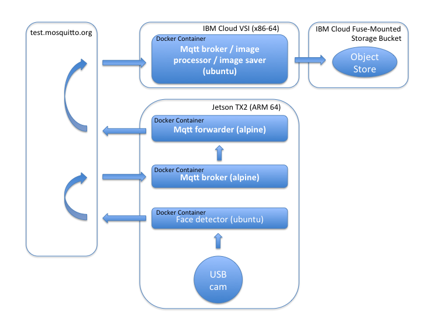

# W251 HW03 IOT 101
https://github.com/adamsohn/v2/tree/master/week03/hw

This README file demonstrates installation and execution an IOT pipeline to capture face images with a webcam connected to an NVIDIA Jetson TX2 and publish the images to a cloud-based object store.

#### Contents
1. Configuration Overview
2. Create VSI (Virtual Server Instance )
3. Create a Cloud-Based Object Store & mount to VSI
4. Jetson TX2 Config <br>
    a. Installing Docker <br>
    b. Creating Local Bridge Network <br>
    c. Create Docker image <br>
5. VSI Config<br>
    a. Installing Docker<br>
    b. Create Docker image<br>
6. Spin-up all containers & administer scripts<br>
    a. Jetson<br>
    b. VSI<br>
7. View Results
8. Lessons Learned

#### 1. Configuration Overview 
(Scroll Right!) 



| Scope            | Face Detection                    | mqtt Broker                 | mqtt Forwarder                | mqtt Broker/Image Save                                                                                       |
|------------------|-----------------------------------|-----------------------------|-------------------------------|--------------------------------------------------------------------------------------------------------------|
| Host System      | Jetson TX2                        | Jetson TX2                  | Jetson TX2                    | Cloud VM                                                                                                     |
| Dockerfile       | Dockerfile.jet_ubuntu_face_detect | Dockerfile.apline_mqtt      | Dockerfile.apline_mqtt        | Dockerfile.ubuntu_mqtt                                                                                       |
| Dockerfile basis | ubuntu                            | eclipse-mosquitto           | eclipse-mosquitto             | ubuntu                                                                                                       |
| Image name       | i_jet_ubuntu_face_detect          | i_apline_mqtt               | i_apline_mqtt                 | i_ubuntu_mqtt                                                                                                |
| Container name   | jet_detect                        | jet_broker                  | jet_fwd                       | vsi_broker                                                                                                   |
| Container OS     | Ubuntu                            | Alpine                      | Alpine                        | Ubuntu                                                                                                       |
| Docker network   | face_brg                          | face_brg                    | face_brg                      | NA                                                                                                           |
| Shell script     | jet_ubuntu_face_detect.sh         | jet_alpine_mqtt_broker.sh   | jet_alpine_mqtt_msg_fwdr.sh   | vsi_alpine_mqtt_broker_fwdr.sh                                                                               |
| MQTT .conf       | NA                                | jet_alpine_mqtt_broker.conf | jet_alpine_mqtt_msg_fwdr.conf | NA                                                                                                           |
| Port             | not defined:1883                  | not defined:1883            | not defined:1883              | not defined:1883                                                                                             |
| IP Address       | Docker assigned                   | Docker assigned             | Docker assigned               | Public IP 50.22.155.218 <br> Public image store  https://cossohn.s3.us-east.cloud-object-storage.appdomain.cloud |
| Python file      | jet_ubuntu_face_detect.py         | NA                          | NA                            | vsi_alpine_mqtt_broker_fwdr.py                                                                               |


Note that mqtt message Quality of Service `qos = 1` was chosen. `qos = 1` ensures (`qos = 0` would not ensure) the message is delivered at least once (`qos = 2` would guarantee no more than once). For this project, `qos = 1` is sufficient service and avoids overwhelming web host. 

#### 2. Create a VSI (Virtual Server Infrastructure)
Instructions to obtain IBM account, install CLI on local machine, generating/posting SSH keys, or hardening VSI server against hackers can be found @ [Wk2 Homework]( https://github.com/MIDS-scaling-up/v2/tree/master/week02/hw). 

IBM CLI command is to spin up a 2-CPU, 4GB RAM device using IBM Cloud CLI. Note that your (ssh) key will vary (reference [Wk2 Homework]( https://github.com/MIDS-scaling-up/v2/tree/master/week02/hw))

```
ibmcloud sl vs create --datacenter=sea01 --domain=251.cloud --hostname=ibm1 --os=UBUNTU_18_64 --cpu=2 --memory=4096 --billing=hourly --key=1693148
```
#### 3. Create a Cloud-Based Object Store & Mount to VSI
Instructions can be found at [Wk2Lab2](https://github.com/MIDS-scaling-up/v2/tree/master/week02/lab2)
* Replace URL in mount command with URL from your `endpoints` service credential.
* For compability with scripts, replace `/mnt/mybucket` with `/mnt/photobucket_hw03`

Validate your installation by creating a file in `/mnt/photobucket_hw03` and viewing file at your public URL as noted on cloud.ibm.com ('...' menu for your bucket).
#### 4a. Jetson TX2 > On-Host: Install Docker
Not necessary/already installed from prior activities. Process matches Docker install for VSI (step 5a), except for Jetson, `[arch=amd64]` would be replaced by `[arch=aarch64]`

#### 4b. Jetson TX2 > On-Host: Creating Local Bridge Network
Docker Local Bridge Network `face_brg` is built to support connectivity between Jetson containers. 
```
docker network create --driver bridge face_brg
```
Reference: List Docker networks 
```
docker network ls
```

#### 4c. Jetson TX 2 > On-Host: Create Docker image
Face Detection
```
docker build --network=face_brg -t i_jet_ubuntu_face_detect -f Dockerfile.jet_ubuntu_face_detect .
```

mqtt Broker and Forwarder (uses same Docker image)
```
docker build --network=face_brg -t i_alpine_mqtt -f Dockerfile.alpine_mqtt .
```

#### 4d. Jetson TX2 > On-Host: Create shell scripts to spin up Docker containers
Store shell scripts @ /HW03. This directory (volume) will be made accessible to the container in the Docker run script. 

#### 5a. Virtual Server Instance > On-Host: Installing Docker
```
apt-get install -y \
    apt-transport-https \
    ca-certificates \
    curl \
    software-properties-common

curl -fsSL https://download.docker.com/linux/ubuntu/gpg | sudo apt-key add -

sudo add-apt-repository \
   "deb [arch=amd64] https://download.docker.com/linux/ubuntu \
   $(lsb_release -cs) \
   stable"	

apt-get update

apt-get install -y docker-ce
```
Validate installation
```
docker run hello-world
```
#### 5b. Virtual Server Instance > On-Host: Create Docker image
mqtt Broker/Image Save 
```
docker build -t i_ubuntu_mqtt -f Dockerfile.ubuntu_mqtt .
```
#### 6a. Jetson: Spin-up all containers & administer scripts

Broker > On-Host
```
chmod +x jet_alpine_mqtt_broker.sh
./jet_alpine_mqtt_broker.sh
```
Forwarder > On-Host
```
chmod +x jet_alpine_mqtt_msg_fwdr.sh
./jet_alpine_mqtt_msg_fwdr.sh
```
Face Detection > On-Host
```
chmod +x jet_ubuntu_face_detect.sh
./jet_ubuntu_face_detect.sh
```
Face Detection > In-Docker
```
python3 jet_ubuntu_face_detect.py
```
Note that the Docker terminal will show when new files have arrived.

#### 6b. VSI: Spin-up all containers & administer scripts
Broker/Image Save > On-Host
```
apt install x11-xserver-utils
chmod +x vsi_alpine_mqtt_broker_fwdr.sh
./vsi_alpine_mqtt_broker_fwdr.sh
```
Face Detection > In-Docker
```
python3 vsi_alpine_mqtt_broker_fwdr.py
```
Note that the Docker terminal will show detection steps, including workflow for when face is found.
#### 7. View Results
https://cossohn.s3.us-east.cloud-object-storage.appdomain.cloud/img_02_21_20_02_33_24.png <br>

#### 8. Lessons Learned
* Debugging a system is more complicated than troubleshooting individual elements. Code scrutiny, system mapping, verbose output, and unit-test cases are crucial for debug.
* It is a simpler development strategy to use a generic Dockerfile base package and add in necessary elements vs. comprehending unrelated elements in a highly-customized Dockerfile.
* The following tools were heavily used and well-appreciated: Github, [Online Live Markdown Editor https://dillinger.io/](https://dillinger.io/), [Online Live Markkdown Table Editor https://www.tablesgenerator.com](https://www.tablesgenerator.com/markdown_tables), [MAC VNC Client: Chicken of the VNC](https://sourceforge.net/projects/cotvnc/)
